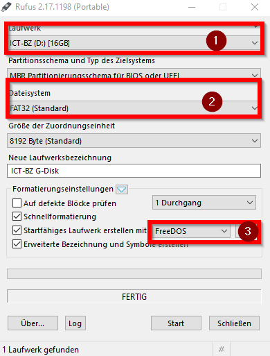

# Lösch Stick

Am ende unserer Kurse müssen die Lernenden Ihre Labor-Geräte Löschen. Dafür haben wir sogenannte ``Löschsticks``. Bootet man en Gerät von diesem USB-Stick, kann die Harddisc mit wenigen Klicks gelöscht werden. 

## Instalationsanleitung

Zuerst muss man ein USB-Stick mit DOS bootfähig machen. Dies Funktioniert ganz einfach über das Tool [Rufus](https://rufus.ie/). 



Beim Erstellen muss auf diese drei Punkte geachtet werden. 
1. Hier wird der Gewünschte USB-Stick ausgewählt. 

2. Hier muss das Dateisystem FAT32 ausgewählt werden. Ansonsten ist Punkt 3 Nicht anwählbar. 

3. Hier kann nun als System ``FreeDOS`` ausgewählt werden. 


Nach dem Beschreiben müssen noch die Dateien auf den USB-Stick kopiert werden. 
- [AUTOEXEC.BAT](./AUTOEXEC.BAT)
- [autorun.ico](/autorun.ico)
- [autorun.inf](/autorun.inf)
- [CLEAN.BAT](/CLEAN.BAT)
- [gdisk.exe](/gdisk.exe)

## Funktion des USB-Sticks

Über de ``AUTOEXC.BAT`` wird beim Start ein Scrip gestartet. Dies passiert über folgende Zeile.
```bat
:2
clean.bat
```

Das Batch-Skript gibt eine Info aus und warnt davor das mit dem Bestätigen alle Daten gelöscht werden. 

```bat
@ECHO OFF
ECHO *************************************************************************
ECHO **				Loesch-Stick				  							**
ECHO **									  									**
ECHO **         Loesche den Datentraeger HD oder SSD                    	**
ECHO **         ICT-Berufsbildung Zentralschweiz 2020			 			**
ECHO **		https://github.com/julianbruegger/Loesch-Stick		 			**
ECHO *************************************************************************
ECHO .                                                                       .
ECHO . Bist du sicher? Alle Daten auf der HD bzw. SSD werden geloescht!      .
ECHO .                                                                       .
ECHO . Um die Daten zu loeschen druecke "Enter" ansonsten Ctrl+C             .
ECHO .                                                                       .
ECHO ...                                                                   ... 
ECHO .........................................................................
pause
GDISK 2 /del /all
GDISK 2 /mbr
```

Nach der Bestätigung mit der Enter-Taste wird über die ``gdisk.exe`` das Dateisystem der eingebauten Festplatte gelöscht. 


